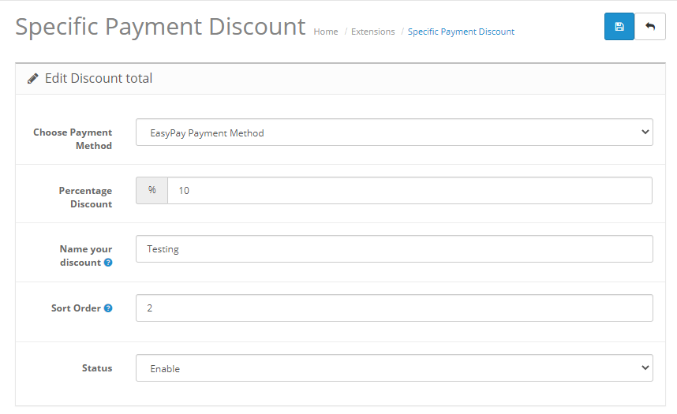

# Opencart Specific Payment Discount 2.x

Choose specific payment method that you want to make discount to users if they select it.
Good solution if you want to promote payment methods.

### Installation Instruction 
_Automatic_
1. Download the file `payment_discount.ocmod.zip`.
2. Go to `Extensions>>Installer`
3. Upload the file
4. Rebuild the modifications cache. Access your Opencart Admin and go to Extensions > Modifications and click on the blue Refresh button (top right corner).
5. Go to `Extensions>>Extensions` and choose **Order Totals** as the extension type.
6. Install the __Payment Discount (Lite)__ extension.
7. Click on `Edit`.
8. Enable the extension, set the percentage discount and text description.
9. Save.
10. And that's it!!!

### Screenshots

